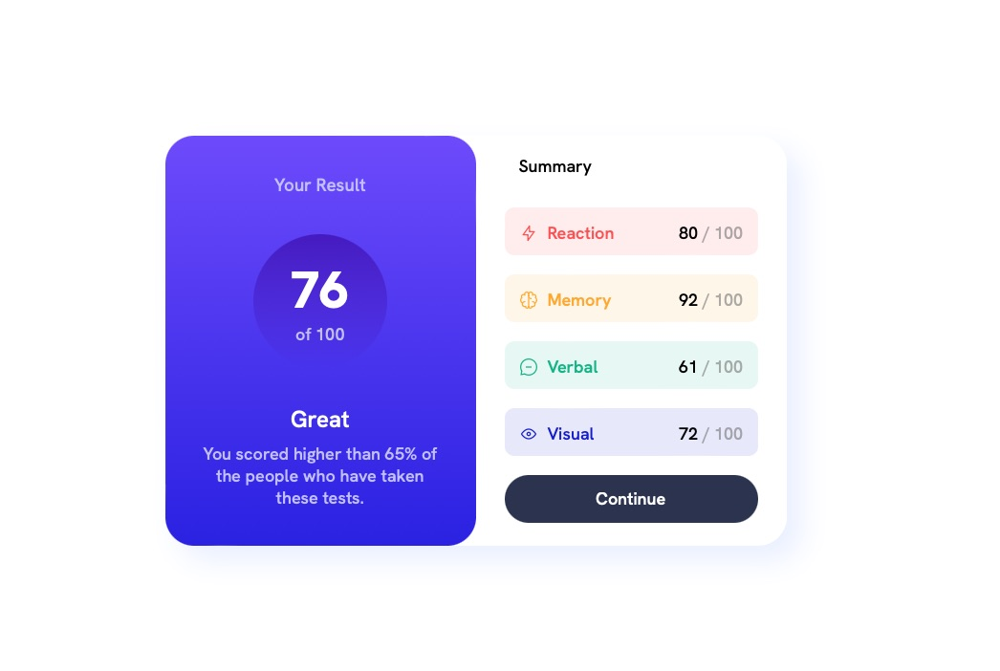

# Results summary component solution

This is a solution to the [Results summary component challenge on Frontend Mentor](https://www.frontendmentor.io/challenges/results-summary-component-CE_K6s0maV). Frontend Mentor challenges help you improve your coding skills by building realistic projects.

### Screenshot

### Links

- Solution URL: [Solution](https://www.frontendmentor.io/solutions/results-summary-component-responsive-web-design-Py-sREtZtf)
- Live Site URL: [Live site](results-summary-component-13.netlify.app)

## My process

### Built with

- Responsive Web Design
- Semantic HTML5 markup
- CSS custom properties
- Flexbox
- Mobile-first workflow

## Author

- Linkedin - [Gurău Iulian](https://www.linkedin.com/in/gurău-iulian/)
- Frontend Mentor - [@giulian13](https://www.frontendmentor.io/profile/giulian13)
- GitHub - [@giulian13](https://github.com/giulian13/)
